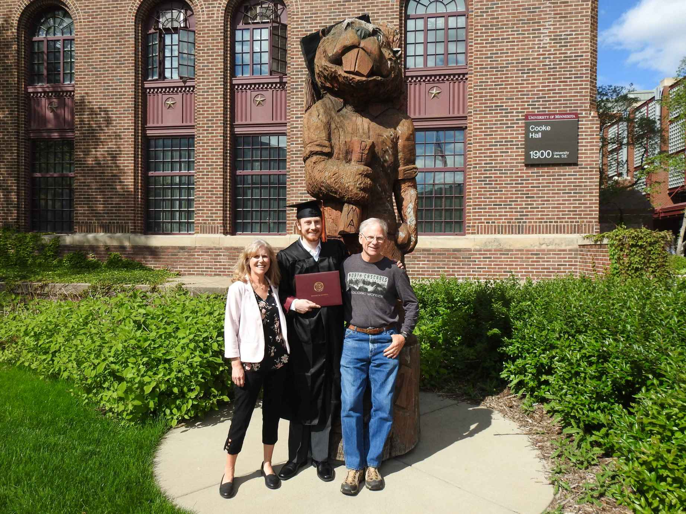
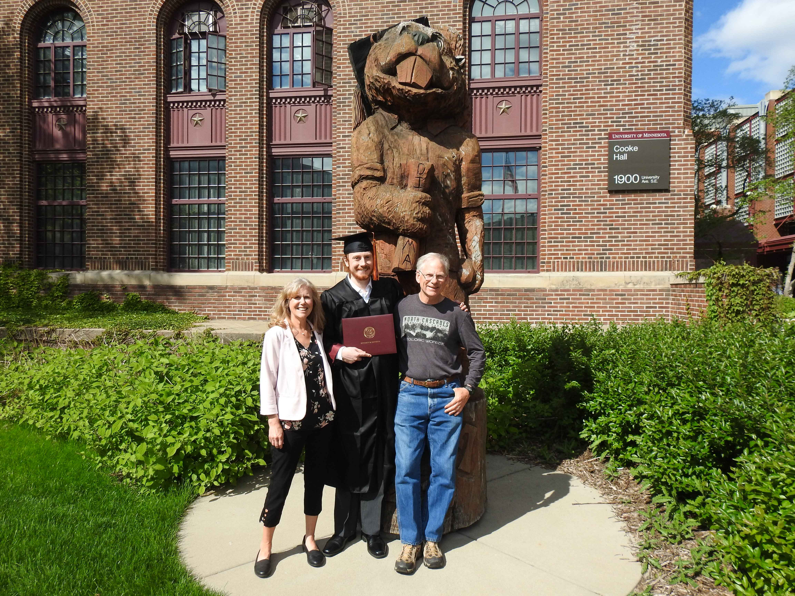
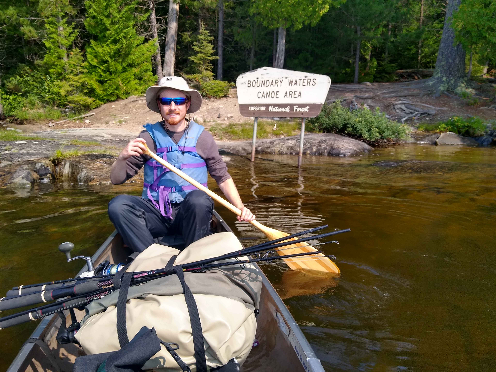
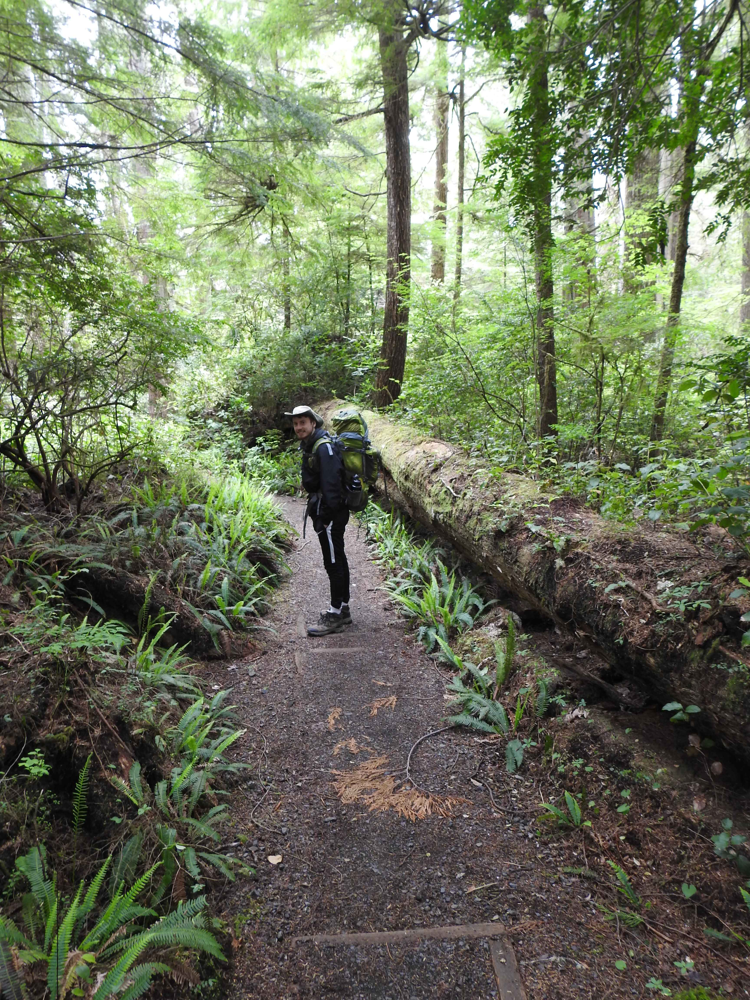

## About Me

M.Sc in Robotics & Minor in Mechanical Engineering @ University of Minnesota  
B.Sc in Computer engineering @ University of Minnesota  
<table style="border: none; background: transparent; width: 100%;">
  <tr>
    <td style="width: 70%; vertical-align: top; border: none; padding-right: 20px;">
      

        I am a robotics engineer and graduate researcher in the Medical Robotics and Devices Lab at the University of Minnesota, where I work with <a href="https://cse.umn.edu/me/tim-kowalewski">Professor Timothy Kowalewski</a>. My current research focuses on robotic propulsion systems for neurovascular catheters with the goal of enabling accessible telerobotic stroke thrombectomy. What draws me to medical robotics is the combination of meaningful human impact, difficult multidisciplinary engineering problems, and the pace of innovation at the cutting edge of the field. Growing up with a mother who worked as a nurse, I have always wanted to contribute to technologies that can directly improve patient outcomes and access to care.
          
        My role in the lab centers on the mechanical development and validation of robotic systems. I am responsible for the design, manufacturing, and assembly of major mechanical subsystems, including work involving patent-pending technology. I also develop and execute mechanical validation testing to characterize force and torque capabilities and ensure reliable system performance under realistic operating conditions. More detail about my research and my papers can be found <a href="https://jaredschultz214.github.io/research_and_papers">here</a>.
          
        Outside of medical robotics, I have broad interests across robotics as a whole, including computer vision, feedback and control systems, autonomous systems, and mechanical robot design. You can find some of my projects <a href="https://jaredschultz214.github.io/projects">here</a>. I have wanted to work in robotics for as long as I can remember, starting with building projects from Legos and surplus motors with my dad, continuing through Boy Scouts robotics merit badge, and eventually joining my high school robotics team as a freshman. Today, I continue pursuing that passion through both research and competitive robotics.
          
        Much of my time outside of research is spent in the Northstar Club Robotics lab, where I helped found the team and previously served as both Mechanical Lead and Computer Vision Lead. Our competition robots compete in a fast-paced first-person robotic combat environment similar to airsoft or paintball. Our team placed 9th out of 24 teams in both years we have competed so far. These projects have strengthened my ability to rapidly prototype and iterate, anticipate failure cases before fabrication, and work effectively under aggressive deadlines and technical pressure.
          
        Outside of engineering, I enjoy biking, gardening, pottery, pickleball, camping, and spending time outdoors. Time outdoors, namely camping and wilderness travel, has remained important to me since my time in Boy Scouts. For me, being outdoors provides an opportunity to disconnect from constant expectations, reset creatively, and slow down long enough to reflect and recharge. 
          
      

    </td>
    <td style="width: 30%; vertical-align: top; border: none; text-align: center;">
		
		

		    
		

          
		
		

		    
		

          
		
		

		    
		

        

              
            <a href="mailto:schu4422@umn.edu">
                <i class="fa fa-envelope" aria-hidden="true"></i> schu4422@umn.edu</a>  
            <a href="mailto:jaredschultz214@gmail.com">
                <!--<i class="fa fa-envelope" aria-hidden="true"></i>--> jaredschultz214@gmail.com</a>  
            <a href="https://github.com/jaredschultz214">
                <i class="fa fa-github" aria-hidden="true"></i> Github </a>  
            <a href="https://www.linkedin.com/in/jared-schultz-190aa3222/">
                <i class="fa fa-linkedin" aria-hidden="true"></i> LinkedIn </a>  
             
	    

    </td>
    </tr>
</table>
