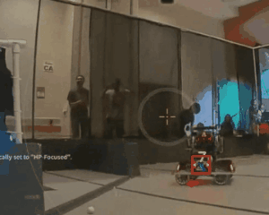
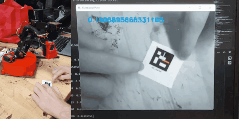
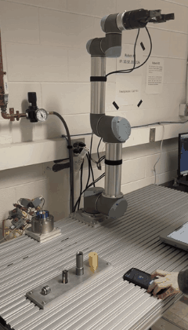
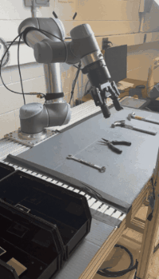
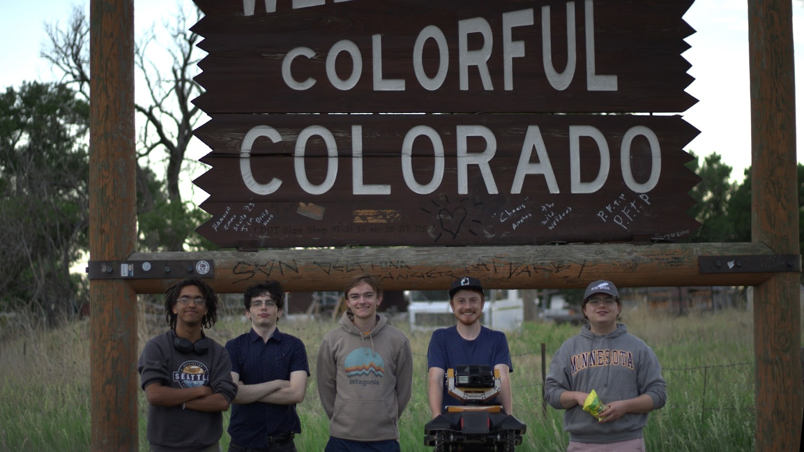
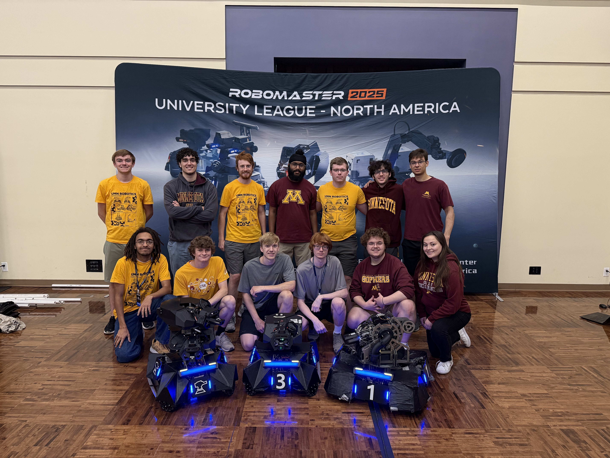

<table>
<tr>
<td width="40%">

</td>
<td width="60%">

## Project Title

Lorem ipsum dolor sit amet, consectetur adipiscing elit.  
Sed do eiusmod tempor incididunt ut labore et dolore magna aliqua.  
Ut enim ad minim veniam, quis nostrud exercitation ullamco laboris.

### Features
- Feature one
- Feature two
- Feature three

[View Project](#)

</td>
</tr>
</table>

 

<table>
<tr>
<td width="40%">

</td>
<td width="60%">

## Another Project

Lorem ipsum dolor sit amet, consectetur adipiscing elit.  
Ut enim ad minim veniam, quis nostrud exercitation ullamco laboris nisi ut aliquip ex ea commodo consequat.

### Tech Stack
- Python
- OpenCV
- ROS

[GitHub Repo](#)

</td>
</tr>
</table>

 

<table>
<tr>
<td width="40%">

</td>
<td width="60%">

## Project 3

Lorem ipsum dolor sit amet, consectetur adipiscing elit.  
Ut enim ad minim veniam, quis nostrud exercitation ullamco laboris nisi ut aliquip ex ea commodo consequat.

### Tech Stack
- Python
- OpenCV
- ROS

[GitHub Repo](#)

</td>
</tr>
</table>

<table>
<tr>
<td width="40%" valign="top">

</td>

<td width="60%" valign="top">

## Project 4

Lorem ipsum dolor sit amet, consectetur adipiscing elit.  
Ut enim ad minim veniam, quis nostrud exercitation ullamco laboris nisi ut aliquip ex ea commodo consequat.

### Tech Stack
- Python
- OpenCV
- ROS

[GitHub Repo](#)

</td>
</tr>
</table>

<table>
<tr>
<td width="40%">

</td>
<td width="60%">

## Project 5

Lorem ipsum dolor sit amet, consectetur adipiscing elit.  
Ut enim ad minim veniam, quis nostrud exercitation ullamco laboris nisi ut aliquip ex ea commodo consequat.

### Tech Stack
- Python
- OpenCV
- ROS

[GitHub Repo](#)

</td>
</tr>
</table>