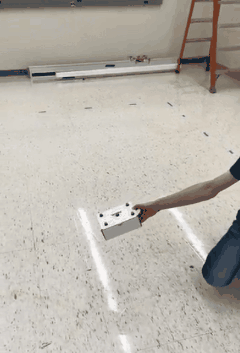

<table>
    <tr>
        <td width="40%" valign="top">
            
        </td>
        <td width="60%" valign="top">
            

                <strong style="font-size: 1.2em;">
                    Computer Vision and ML system for the Robomaster Project
                </strong>
                
                    1/2025 – 6/2025
                
            

            <ul>
                <li>Created a “product” that identifies, tracks, and predicts the movement of robots in a moving-camera, moving-target environment. </li>
                <li>Optimized the developed solution to run in real time on limited hardware while preserving all functionality. </li>
                <li>Achieved 98% classification accuracy and a full loop time of under 3 milliseconds, successfully fulfilling the design requirements set by our client.</li>
            </ul>
            <a href="https://github.com/jaredschultz214/North-Star-2025-CV">
                <i class="fa fa-github" aria-hidden="true"></i> Github 
            </a>
        </td>
    </tr>
</table>

<table>
    <tr>
        <td width="40%" valign="top">
            
        </td>
        <td width="60%" valign="top">
            

                <strong style="font-size: 1.2em;">
                    hyper-redundant robot control and dynamics
                </strong>
                
                    9/2024 – 12/2024
                
            

            <ul>
                <li>Implemented kinematics, self-motion, and path planning onto a hyper-redundant robot </li>
                <li>Utalizing ArUco markers, map from real world corrdinates through screen coordinates to endeffector coordinates</li>
            </ul>
            <a href="https://github.com/jaredschultz214/hyper-redundant-robot">
                <i class="fa fa-github" aria-hidden="true"></i> Github
            </a> 
        </td>
    </tr>
</table>

<table>
    <tr>
        <td width="40%" valign="top">
            
        </td>
        <td width="60%" valign="top">
            

                <strong style="font-size: 1.2em;">
                    Robot Vision Final Project
                </strong>
                
                    9/2024 – 12/2024
                
            

            <ul>
                <li>Designed and built from scratch an autonomous 6 DOF arm able to simulate industrial pick-and-place tasks</li>
                <li>Implemented vision algorithms to allow the robot to recognize specific objects</li>
                <li>Developed and debugged a custom position-based visual servoing algorithm to allow for dynamic object tracking</li>
            </ul>
            <a href="https://github.com/jaredschultz214/Jacobian_PBVS">
                <i class="fa fa-github" aria-hidden="true"></i> Github
            </a>
        </td>
    </tr>
</table>

<table>
    <tr>
        <td width="40%" valign="top" style="border: none;">
            

                
                
            

        </td>
        <td width="60%" valign="top">
            

                <strong style="font-size: 1.2em;">
                    UR5 Pick and Place
                </strong>
                
                    1/2024 – 6/2024
                
            

            <ul>
                <li>Using a UR5 arm, an industrial pick-and-place task was programmed and optimized to run in a minimal cycle time </li>
                <li>Programmed a CNN CV model allowing the UR5 arm to classify tools on a workspace and put them in their assigned buckets </li>
            </ul>
            <a href="https://github.com/jaredschultz214/UR5_operation">
                <i class="fa fa-github" aria-hidden="true"></i> Github
            </a>
        </td>
    </tr>
</table>

<table>
    <tr>
        <td width="40%" valign="top">
            
        </td>
        <td width="60%" valign="top">
            

                <strong style="font-size: 1.2em;">
                    Autonomous Quadrotor for Education
                </strong>
                
                    12/2023 – 5/2024
                
            

            <ul>
                <li>Assisted a professor in exploratory research and completed the initial steps in creating a new class for autonomous aerial flight and tracking.</li>
                <li>Communicated with software vendors to troubleshoot and resolve system bugs.</li>
                <li>Implemented signal processing and path planning algorithms in a pipeline to allow the real-time position of the drone to be used to follow a path or object autonomously.</li>
            </ul>
        </td>
    </tr>
</table>

<table>
    <tr>
        <td width="40%" valign="top">
            
            
        </td>
        <td width="60%" valign="top">
            

                <strong style="font-size: 1.2em;">
                    Robotics Club projects (Northstar,  NASA Lunabotics, Robot in Three Days)	
                </strong>
                
                    1/2021 – Present
                
            

            <ul>
                <li>Work under a time crunch to design and manufacture a robot to fulfill a task as specified by the competition. </li>
                <li>Use machine learning and vision tracking to improve the accuracy of the manipulator and perform localization.</li>
                <li>Create a series of professional videos and a white paper documenting our engineering processes.</li>
                <li>Coordinate workshops to teach new members essential CAD and machining skills necessary for team success.</li>
                <li>Facilitate design reviews to ensure that designs minimize complexity while maintaining functionality and adhering to competition rules.</li>
                <li>Organize and lead meetings, delegating tasks to team members to ensure adherence to the design schedule.</li>
            </ul>
            <a href="https://studentrobotics.umn.edu/our-projects">
                Team website
            </a> 
             
            <a href="https://www.youtube.com/@umnrobotics">
                <i class="fa fa-youtube" aria-hidden="true"></i> Youtube
            </a>
        </td>
    </tr>
</table>