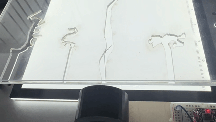
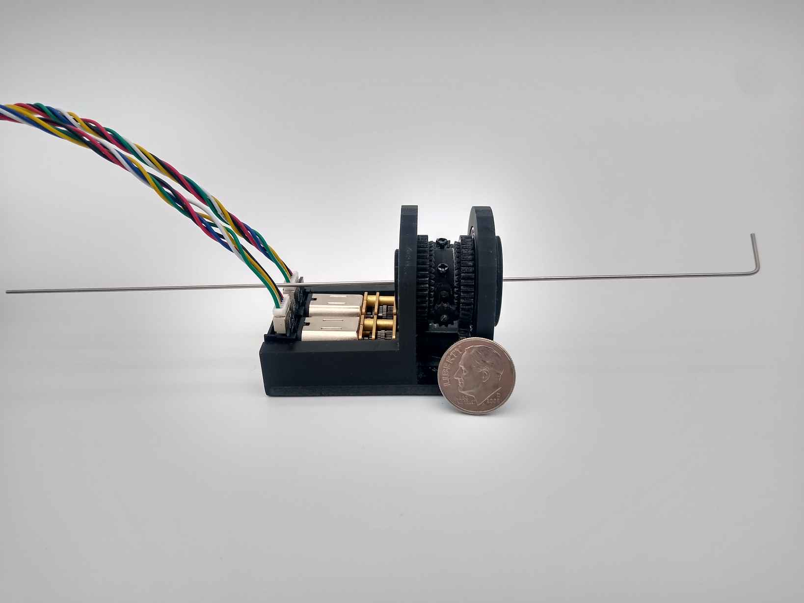
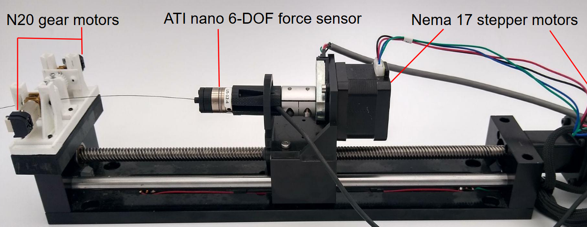
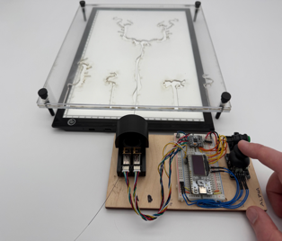

<table>
    <tr>
        <td width="40%" valign="top">
            
            
        </td>
        <td width="60%" valign="top">
            

                <strong style="font-size: 1.2em;">
                    Lead Mechatronic Designer for TRUST Surgical Stroke Robot	
                </strong>
                
                    6/2025 – Present
                
            

            <ul>
                <li>Collaborate with neurosurgeons, university faculty, and Medtronic leadership to define system requirements for a cost-efficient robot able to perform remote thrombectomy. </li>
                <li>Develop a comprehensive test suite to characterize prototype performance, accelerate wear, and identify failure modes to promote device longevity.</li>
                <li>Design, manufacture, and test iterative robot prototypes, using results to verify and inform design revisions.</li>
                <li>Design and implement a motor control architecture enabling precise speed and position control of the 3-DOF rolling contact mechanism.</li>
            </ul>
        Try out the <a href="https://alpha.stroke-robot.org/">live telerobotic demo here</a>.
        </td>
    </tr>
</table>

<table>
    <tr>
        <td width="40%" valign="top">
            
        </td>
        <td width="60%" valign="top">
            

                <strong style="font-size: 1.2em;">
                    Friction Characterization of a Roller-Drive Mechanism for Robotic Motion Control of Guidewires 	
                </strong>
                
                    DMD 2026
                
            

            <em>
                Jared Schultz, Pin-Hao Cheng, Matt Rajala, Timothy M. Kowalewski
            </em>
             
            [<a href="https://drive.google.com/file/d/1rFqz86vC7T5juxTHVmXYmkzRNkfE1MBO/view?usp=sharing">PDF</a>]  <a href="https://doi.org/10.1115/DMD2026-1086">doi.org/10.1115/DMD2026-1086</a>.
              
        </td>
    </tr>
</table>

<table>
    <tr>
        <td width="40%" valign="top">
            
        </td>
        <td width="60%" valign="top">
            

                <strong style="font-size: 1.2em;">
                    Towards Remote Thrombectomy with Telerobotically-Driven Guidewires
                </strong>
                
                    DMD 2026
                
            

            <em>
                Pin-Hao Cheng*, Ronak Narkhede*, Matt Rajala*, Jared Schultz*, Nathan Harbinson, Samuel Fisher, Nitish Poojari, Sharva Khandagale, Alex Berg, Keara Berlin, Adam Imdieke, Michael Feldkamp, Scott Frushour, Kaustubh Patil, Mark Ashby, William Peine, Sean L. Moen, Andrew Grande, Karthik Desingh, Timothy M. Kowalewski.
                 * Contributed equally, listed alphabetically by last name
            </em>
             
            [<a href="https://drive.google.com/file/d/1dCSkEQtBogViqxwVy3-YNULPSXtdwxK_/view?usp=sharing">PDF</a>] <a href="https://doi.org/10.1115/DMD2026-1079">doi.org/10.1115/DMD2026-1079</a>.
              
        </td>
    </tr>
</table>
